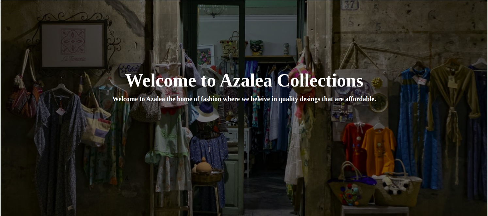

# AZALEA DESIGNS

#### Authors
### 1. [Esther Ndichu](https://github.com/estherndichu)
### 2. [Stephen Ndele](https://github.com/stephenndele)
### 3. [Naaman Sang](https://github.com/naamansang)
### 4. [Felix Chegero](https://github.com/chegrofelix)
### 5. [Bramuel Amariati](https://github.com/Atsalibram)
### 6. [David Ngugi](https://github.com/Drongo-1)
## Description
This is an application that brings together lovers of fashion. Designers get a platform to showcase their designs. Potential clients get to have a range of options to choose from.
### Setup/Installation Requirements
* Open terminal on your computer.
* cd the location where you want this project.
* git clone https://github.com/estherndichu/azalea-designers.git
* Create your own github branch and edit the code as you wish.
## BEHAVIOR DRIVEN DEVELOPMENT(BDD)
* User can access a wide range of designer clothes by different designers/tailors.
* Designers get to showcase their amazing designs.
* Clients can buy whatever item they are interested in.
* Click on this link to see the application : https://github.com/estherndichu/azalea-designers.git
## Technologies Used
This application has been built using 
* HTML
* CSS
* JavaScript
* Bootstrap
* Jquery
## Support and contact details
For any queries or further clarification on the directions to use the application, contact via email:itskuijenga@gmail.com
 ### [License](./licence)